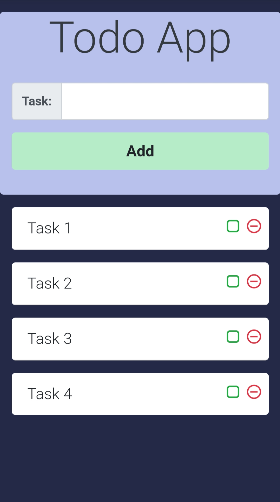

# Todo App with HTML CSS And JavaScript

[Go to App](https://yuvraajsj18.github.io/Todo-With-HTML-CSS-JavaScript/)

## Features
  - Add tasks to todo list
  - Mark tasks as done in todo list
  - remove tasks from todo list

## Technology Stack
  - HTML - for creating the skeleton of the web page
  - CSS with Bootstrap framework - for styling the web page
  - JavaScript - for programming the behavior of the web page
  - Material Icons - for icons
  - Animate.style - for css animations
